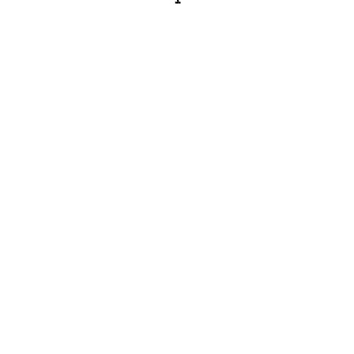
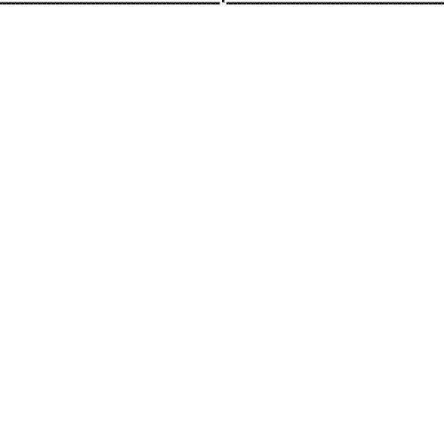

# Elementary Cellular Automaton
Wolfram MathWorld - Elementary Cellular Automaton

## What is it
The simplest class of one-dimensional cellular automata. Elementary cellular automata have two possible values for each cell (0 or 1), and rules that depend only on nearest neighbor values. As a result, the evolution of an elementary cellular automaton can completely be described by a table specifying the state a given cell will have in the next generation based on the value of the cell to its left, the value the cell itself, and the value of the cell to its right. Since there are 2×2×2=2^3=8 possible binary states for the three cells neighboring a given cell, there are a total of 2^8=256 elementary cellular automata, each of which can be indexed with an 8-bit binary number (Wolfram 1983, 2002). For example, the table giving the evolution of rule 30 (30 = 00011110) is illustrated above. In this diagram, the possible values of the three neighboring cells are shown in the top row of each panel, and the resulting value the central cell takes in the next generation is shown below in the center. n generations of elementary cellular automaton rule r are implemented as CellularAutomaton[r, {{1}, 0}, n].

The evolution of a one-dimensional cellular automaton can be illustrated by starting with the initial state (generation zero) in the first row, the first generation on the second row, and so on. For example, the figure above illustrated the first 20 generations of the rule 30 elementary cellular automaton starting with a single black cell.

> For me info: https://mathworld.wolfram.com/ElementaryCellularAutomaton.html

## Generated images

* Rule 30

|Rule 30|Rule 60|
|-|-|
|||
|Rule 90|Rule 126|
|||
|Rule 90|Rule 126|
|||

